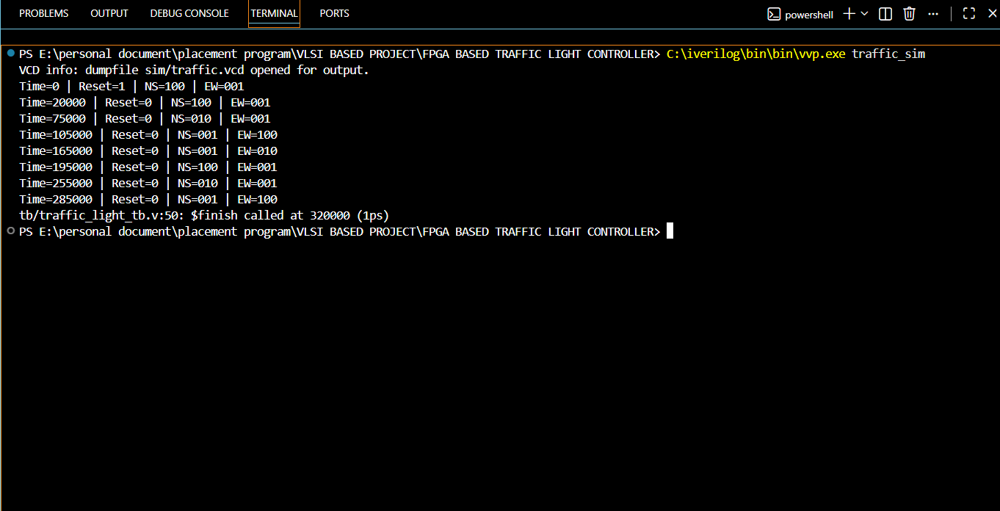
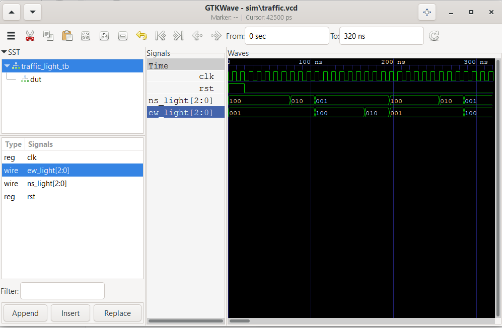
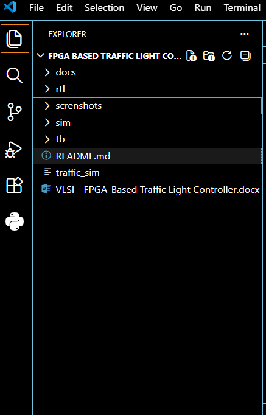

# FPGA-Based Traffic Light Controller

## Project Overview

This project implements a Traffic Light Controller using Verilog HDL and Finite State Machine (FSM) architecture. The design controls traffic signals for two intersecting roads: North-South (NS) and East-West (EW).

The controller was designed, simulated, and verified using industry-standard digital design methodology.

## Features

* Finite State Machine (FSM) Based Design
* Verilog HDL Implementation
* Functional Verification Using Testbench
* Waveform Analysis Using GTKWave
* Synthesizable RTL Design
* FPGA Ready Architecture
* GitHub Portfolio Project

---

## Design Flow

Specification
→ FSM Design
→ RTL Coding
→ Testbench Development
→ Simulation
→ Waveform Verification

---

## FSM States

| State | North-South | East-West |
| ----- | ----------- | --------- |
| S0    | Green       | Red       |
| S1    | Yellow      | Red       |
| S2    | Red         | Green     |
| S3    | Red         | Yellow    |

State Transition:

S0 → S1 → S2 → S3 → S0

---

## Traffic Light Encoding

| Binary Value | Signal |
| ------------ | ------ |
| 3'b100       | Green  |
| 3'b010       | Yellow |
| 3'b001       | Red    |

---

## Tools Used

* Verilog HDL
* Icarus Verilog
* GTKWave
* Visual Studio Code

---

## Project Structure

FPGA-Traffic-Light-Controller/

├── docs/

├── rtl/

├── tb/

├── sim/

├── screenshots/

└── README.md

---

## Simulation Results

### Simulation Console Output

### GTKWave Verification

### Project Structure

---

## Verification Results

* Reset functionality verified
* Correct FSM state transitions verified
* Timer operation verified
* Traffic light sequencing verified
* No conflicting GREEN signals observed
* Waveforms validated using GTKWave

---

## Future Enhancements

* Pedestrian Crossing Button
* Emergency Vehicle Priority System
* Traffic Density Based Signal Timing
* Seven Segment Countdown Display
* Adaptive Traffic Control System

---

## Learning Outcomes

Through this project, the following VLSI and Digital Design concepts were implemented:

* Finite State Machine (FSM)
* Sequential Logic Design
* Combinational Logic Design
* Counters and Timers
* RTL Design
* Functional Verification
* Testbench Development
* Waveform Debugging

---

## Author

Suresh Chandra Padhiali

B.Tech Computer Science and Engineering

VLSI Design and FPGA Projects Portfolio

---

## Resume Description

Designed and verified an FPGA-Based Traffic Light Controller using Verilog HDL and Finite State Machine (FSM) architecture. Developed synthesizable RTL, created a verification testbench, performed functional simulation using Icarus Verilog, and analyzed waveforms using GTKWave.
